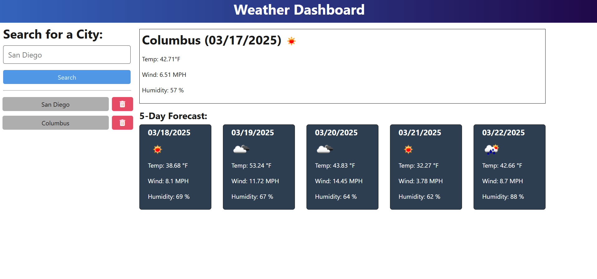

# Weather Dashboard

## Description

The Weather Dashboard is a full-stack application that allows users to search for weather forecasts by city. It provides current weather conditions and a 5-day forecast. The application also maintains a search history, allowing users to revisit previous searches.

## Features

- Search for weather data by city name.
- View current weather conditions, including temperature, wind speed, and humidity.
- View a 5-day weather forecast.
- Save search history for quick access to previous searches.
- Delete cities from the search history.

## Technologies Used

- **Frontend**: TypeScript, Vite, Bootstrap, FontAwesome
- **Backend**: Node.js, Express.js, TypeScript
- **APIs**: OpenWeatherMap API
- **Database**: JSON file for search history
- **Other Tools**: dotenv, dayjs, uuid

## Installation

1. Clone the repository:
   ```bash
   git clone <repository-url>
   cd challenge-9
   ```

2. Install dependencies for both the server and client:
   ```bash
   npm run install
   ```

3. Create a `.env` file in the `Develop/server` directory with the following variables:
   ```env
   PORT=3001
   API_BASE_URL=https://api.openweathermap.org
   API_KEY=<your_openweathermap_api_key>
   ```

## Usage

### Development Mode

1. Start the development server:
   ```bash
   npm run start:dev
   ```

2. Open your browser and navigate to `http://localhost:3000`.

### Production Mode

1. Build the client:
   ```bash
   npm run client:build
   ```

2. Start the server:
   ```bash
   npm run start
   ```

3. Open your browser and navigate to `http://localhost:3001`.

## API Endpoints

### Weather API

- **POST** `/api/weather/`
  - Request Body: `{ "cityName": "City Name" }`
  - Response: Weather data for the specified city.

- **GET** `/api/weather/history`
  - Response: List of previously searched cities.

- **DELETE** `/api/weather/history/:id`
  - Deletes a city from the search history by its ID.

## File Structure

```
Develop/
├── client/          # Frontend code
│   ├── src/
│   ├── styles/
│   ├── index.html
│   └── vite.config.js
├── server/          # Backend code
│   ├── src/
│   ├── db/
│   ├── .env
│   └── package.json
└── package.json     # Root package.json
```

## License

This project is licensed under the MIT License.

## Acknowledgments

- [OpenWeatherMap API](https://openweathermap.org/api)
- [Bootstrap](https://getbootstrap.com/)
- [FontAwesome](https://fontawesome.com/)
